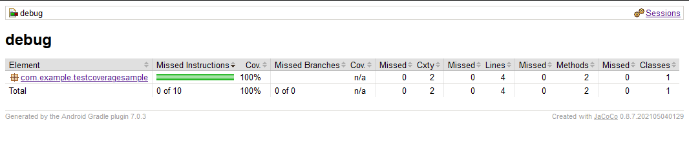

# Android Test Coverage Sample

This is a simple Android app taken from the default Android Studio "Blank Activity" template showing how instrumented test coverage data and reports can be generated whilst using the AndroidX Test Orchestrator and other desirable features such as `clearPackageData`. This targets the latest Android SDK and AGP version.

## Android >=30

1. You need AGP > 7.1.0
2. `androidTestUtil` dependency on `androidx.test.services:test-services`
3. `useTestStorageService` to `"true"` (also, optionally `clearPackageData` to `"true"` if you want actual test isolation)

`./gradlew clean createDebugCoverageReport` now generates a coverage report in app/build/reports/coverage/androidTest/debug/index.html showing about 65% coverage on an emulator running Android 31. Some code is deliberately not covered.

## Android <30

## What do I need to make this work in my app?

There's a number of distinct things that need to be done / set in order for this to work. Missing any one of these will cause issues / failures / no coverage output.

1. Make sure you're using the AndroidX Test Orchestrator, setting the correct arguments for the `AndroidJUnitRunner` in the `build.gradle.kts` file as well as the appropriate jacoco version for AGP to use. Also make sure the value of `coverageFilePath` is a valid path on the test device - emulator images with an sdcard should be able to use `/sdcard/coverage/`:
```kotlin
android {
    defaultConfig {
        testInstrumentationRunner = "androidx.test.runner.AndroidJUnitRunner"
        testInstrumentationRunnerArguments.putAll(
            mapOf(
                "clearPackageData" to "true",
                "coverage" to "true",
                "coverageFilePath" to "/sdcard/coverage/"
            )
        )
    }
    buildTypes {
        named("debug") {
            enableAndroidTestCoverage = true
            enableUnitTestCoverage = true
        }
    }
    testOptions {
        execution = "ANDROIDX_TEST_ORCHESTRATOR"
        animationsDisabled = true
    }
}
```
2. The app under test must have `WRITE_EXTERNAL_STORAGE` permission in its manifest. If you don't need this permission in your actual shipped app, you can create a debug-build-only manifest that will get merged with your main `AndroidManifest.xml` that specifically asks for this permission. Create the manifest in `app/src/debug/AndroidManifest.xml` and ensure it contains:
```
<uses-permission android:name="android.permission.WRITE_EXTERNAL_STORAGE" />
```
3. The app manifest must also specify `android:requestLegacyExternalStorage="true"` as an `application` attribute. In the same debug manifest as above, set:
```
<application android:requestLegacyExternalStorage="true" />
```
4. Each integration test (`androidTest`) must use a `GrantPermissionRule` granting `Manifest.permission.WRITE_EXTERNAL_STORAGE`:
```
@get:Rule
var runtimePermissionRule: GrantPermissionRule =
    GrantPermissionRule.grant(
        Manifest.permission.WRITE_EXTERNAL_STORAGE
    )
```

# How do I reproduce this?

Clone the app, and `./gradlew createDebugCoverageReport` should produce a report in `app/build/reports/coverage/androidTest/debug/` showing 100% test coverage.



## Current issues / Todo

- [X] Only works testing on devices of <=29. Fix for using >=30 which use scoped storage

## Related Google Bug Tracker Issues:

1. https://issuetracker.google.com/issues/123987001
1. https://issuetracker.google.com/issues/175426813
